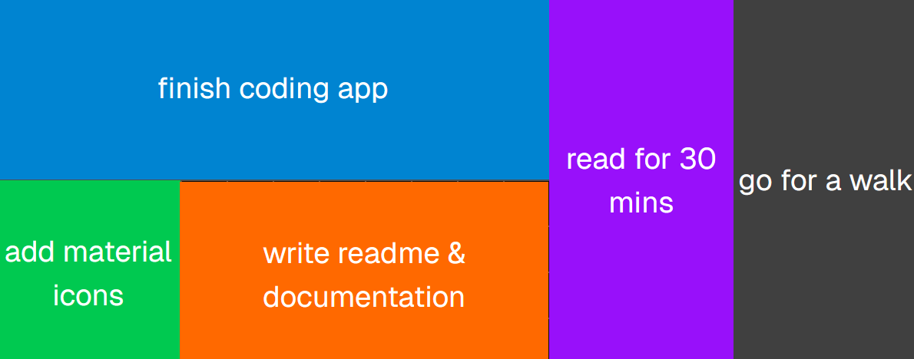
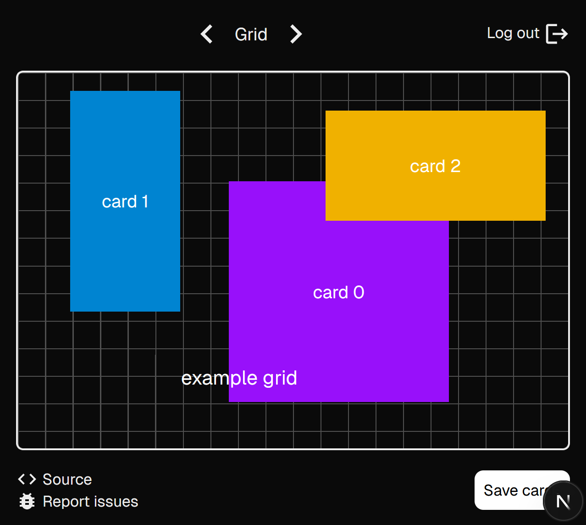
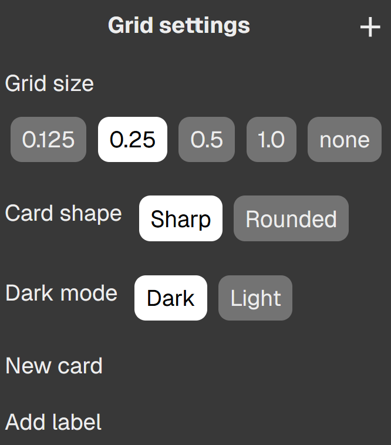
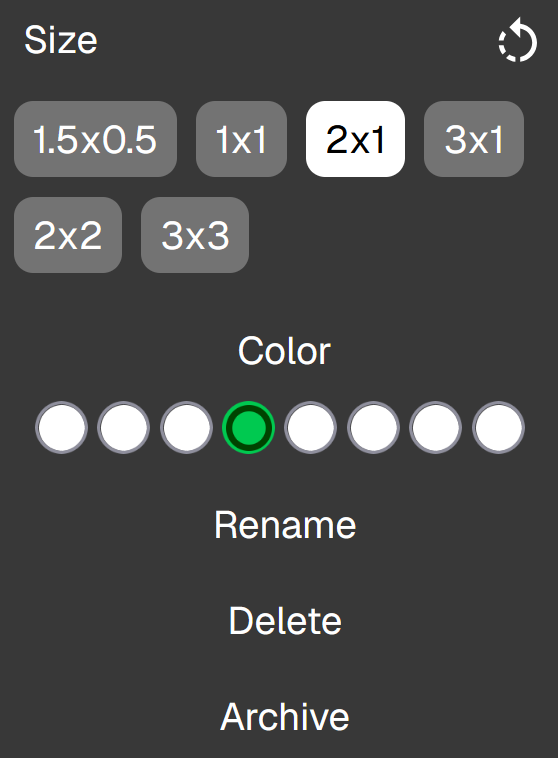

# Task Sandbox

[](#)
[](#)
[](#)

A sandbox with drag and drop cards for task management.

### Features



- **Stack your tasks:** visually see how many tasks you have
- **Drag and drop interface:** convenient and easy to use with the help of the `dnd-kit` React package
- **Context menus:** right click for card options and customization
- **Set different task sizes and colors:** larger cards require more attention
- **Labels:** add freely draggable text to the screen
- **User authentication:** sessions stored using httpOnly browser cookies
<!-- - **Workspaces:** easily move tasks between different screens
- **Archive cards:** Store completed cards in a card or table view -->

\


 

## Local development

- Clone the repo: `git clone https://github.com/ollime/productive-app`
- Install dependencies: `npm install`
- Add the following to the `.env` file:

```
MONGODB_URI=mongodb+srv://[username:password@]host/[database][?options]

ACCESS_TOKEN_SECRET=secret
ACCESS_TOKEN_EXPIRY=15m

ACCESS_REFRESH_SECRET=secret
ACCESS_REFRESH_EXPIRY=1d
```

- Run the server: `npm run dev`
